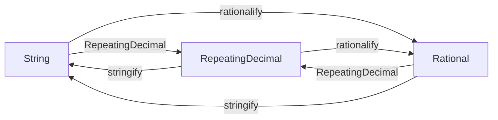

# Design

```@setup design
using RepeatingDecimalNotations
using RepeatingDecimalNotations: stringify, rationalify
using InteractiveUtils
```

## Types that represents repeating decimals
There are three types that represents a repeating decimal number; `String`, `Rational`, and [`RepeatingDecimal`](@ref).

* `Rational{T}`
    * Stores a numerator and a denominator as `T<:Real`.
    * The representation is unique.
    * e.g. `4111111//33300`
* `String`
    * Stores characters that can represent repeating decimals directly.
    * The representation is not unique.
    * e.g. `"123.45(678)"`, `"123.456(786)"`, `"123.456_786_786(786_786)"`
* [`RepeatingDecimal`](@ref)
    * Stores `sign::Bool`, `finite_part::BigInt`, `repeat_part::BigInt`, `point_position::Int`, and `period` to represent a repeating decimal.
    * The representation is not unique.
    * e.g. `RepeatingDecimal(true, 12345, 678, 2, 3)`, `RepeatingDecimal(true, 123456, 786, 3, 3)`, `RepeatingDecimal(true, 123456_786_786, 786_786, 9, 6)`

```@repl design
RepeatingDecimal(true, 12345, 678, 2, 3)
RepeatingDecimal(true, 123456, 786, 3, 3)
RepeatingDecimal(true, 123456_786_786, 786_786, 9, 6)
```

## Converting functions: `stringify`, `rationalify`



* We avoided adding methods to `Base.string` and `Base.rationalize` not to induce type piracy.
* These functions are not exported because the names of these functions does not imply relation to repeating decimals. Please use them like the following in your code.
    * `RepeatingDecimalNotations.stringify(...)`
    * `import RepeatingDecimalNotations: stringify`
    * `using RepeatingDecimalNotations: stringify`

```@repl
using RepeatingDecimalNotations
using RepeatingDecimalNotations: stringify, rationalify
str = "123.45(678)"
rd = RepeatingDecimal(true,12345,678,2,3)
r = 4111111//33300
str == stringify(rd) == stringify(r)
rd == RepeatingDecimal(str) == RepeatingDecimal(r)
r == rationalify(str) == rationalify(rd)
```

## Subtypes of `RepeatingDecimalNotation`
There are several supported notations for repeating decimals.

```@repl design
subtypes(RepeatingDecimalNotation)
```

### `ParenthesesNotation` (Default)
```math
123.45(678)
```

```@repl design
rd"123.45(678)"
no = ParenthesesNotation()
stringify(no, 1//11)
rationalify(no, "123.45(678)")
```

### `DotsNotation`
```math
123.45\dot{6}7\dot{8}
```

TODO: add support for `"123.456̇78̇"`

### `ScientificNotation`
```math
1.2345\text{r}678\text{e}2
```

```@repl design
rd"1.2345r678e2"
no = ScientificNotation()
stringify(no, 1//11)
rationalify(no, "1.2345r678e2")
```

### `EllipsisNotation`
```math
123.45678678...
```

```@repl design
rd"123.45678678..."
no = EllipsisNotation()
stringify(no, 1//11)
rationalify(no, "123.45678678...")
rd"0.4545..."      # Same as 0.(45), repeating [45] two times
rd"0.333..."       # Same as 0.(3), repeating one digit [3] three times
rd"0.13331333..."  # Same as 0.(1333), repeating [1333] has priority over repeating [3]
rd"0.133313333..." # Same as 0.13331(3), adding additional [3] resolves the ambiguity.
```

### Non-supported notation
Vinculum notation ``123.45\overline{678}`` is not supported because it is hard to input with Unicode.

## About the logo


``0.\dot{6}\dot{6} = 12/18`` is [the birthday of the package](https://github.com/hyrodium/RepeatingDecimalNotations.jl/commit/218d639cd0e0ea07449a1ea7e571622cfd2e54fe).
