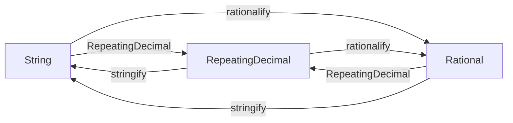

# Design

```@setup design
using RepeatingDecimalNotations
using RepeatingDecimalNotations: stringify, rationalify
using InteractiveUtils
```

## Types that represents repeating decimals
There are three types that represents a repeating decimal number; `String`, `Rational`, and [`RepeatingDecimal`](@ref).

* `Rational`
    * The representation is unique.
    * e.g. `4111111//33300`
* `String`
    * The representation is not unique.
    * e.g. `"123.45(678)"`, `"123.456(786)"`, `"123.456_786_786(786_786)"`
* [`RepeatingDecimal`](@ref)
    * The representation is not unique.
    * e.g. `RepeatingDecimal(true,123,45,678,2,3)`, `RepeatingDecimal(true,123,456,786,3,3)`, `RepeatingDecimal(true,123,456_786_786,786_786,9,6)`

## Converting functions: `stringify`, `rationalify`



* Avoid adding methods to `Base.string` and `Base.rationalize` not to induce Type III piracy.
* These functions are not exported because the names of these functions does not imply relation to repeating decimals Please use them like the following in your code.
    * `RepeatingDecimalNotations.stringify(...)`
    * `import RepeatingDecimalNotations: stringify`

```@repl
using RepeatingDecimalNotations
using RepeatingDecimalNotations: stringify, rationalify
str = "123.45(678)"
rd = RepeatingDecimal(true,123,45,678,2,3)
r = 4111111//33300
str == stringify(rd) == stringify(r)
rd == RepeatingDecimal(str) == RepeatingDecimal(r)
r == rationalify(str) == rationalify(rd)
```

## Subtypes of `RepeatingDecimalNotation`
There are several supported notations for repeating decimals.

```@repl design
subtypes(RepeatingDecimalNotation)
```

### `ParenthesesNotation` (Default)
``123.45(678)`` (`"123.45(678)"`)

### `DotsNotation`
``123.45\dot{6}7\dot{8}`` (`"123.456̇78̇"`)

TODO

### `ScientificNotation`
``123.45r678`` (`"123.45r678"`)

TODO

### `EllipsisNotation`
``123.45678678...`` (`"123.45678678..."`)

TODO

### Non-supported notation
Vinculum notation ``123.45\overline{678}`` is not supported because it is hard to input with Unicode.

## About the logo


``0.\dot{6}\dot{6} = 12/18`` was the day of [the first commit of the repository](https://github.com/hyrodium/RepeatingDecimalNotations.jl/commit/218d639cd0e0ea07449a1ea7e571622cfd2e54fe).
